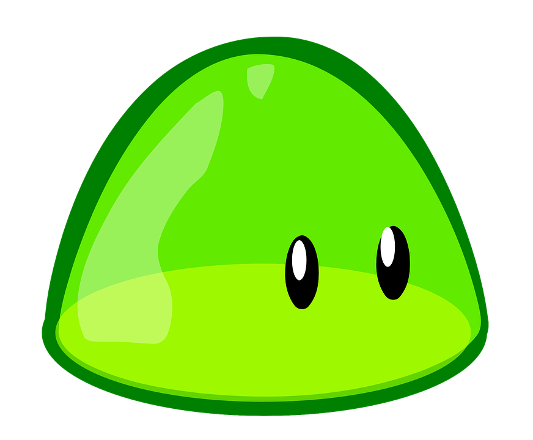

# GOo



 GOo aims to port javascript's underscore functionnalities in Golang, because reinventing the wheel all the time is no fun :(

## Functions Description

### Each()

**Each** loops through a slice of \<any> type.

#### Example:

```
sl := []int{1, 2, 3}
Each(sl, func(el int, i int, s []int) {
    s[i] = el * 2
})

-> [2 4 6]
```

The function ```func(el T, i int, s []T) {}``` is common modifier pattern for slice operations.

```T``` can be **any** type.

```el T``` is the slice element being modified.

```i int``` is the index of the element ```el``` in the slice.

```s []T``` is the slice itself.

### EachMap()

**EachMap** loops through a map, order is not guaranteed.

#### Example:

```
IncrementFunc := func(el int, k string, m map[string]int) {
    m[k] += 1
}

EachMap(myMap, IncrementFunc)
```

the function ```func(el T, k U, m map[U]T)``` is the equivalent of the slices modifier function for maps.

### EachMapOrder()

Same as **EachMap** but loops using the keys alphanumeric order